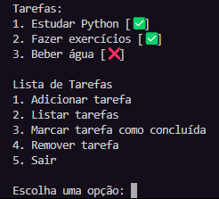

# 📝 To Do List - Projeto em Python



Este é um projeto simples de **Lista de Tarefas (To Do List)** feito em Python, voltado para iniciantes que estão aprendendo a programar.

O objetivo é praticar:
- Manipulação de arquivos (`json`)
- Entrada e saída de dados (`input()` e `print()`)
- Estruturas de controle (`if`, `for`, `try/except`)
- Funções
- Organização de código em scripts

---

## 🚀 Funcionalidades

- ✅ Adicionar novas tarefas
- 📋 Listar tarefas existentes
- ☑️ Marcar tarefas como concluídas
- ❌ Remover tarefas da lista
- 💾 Salvar as tarefas em um arquivo `.json` para uso futuro

---

## 💻 Como executar

1. Clone este repositório:
   ```bash
   git clone https://github.com/EduDalmas/To-Do-List
